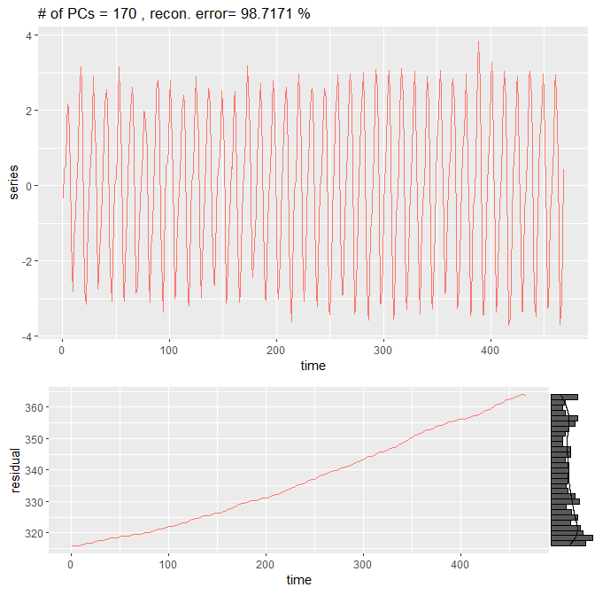

# A Simple Framework for Singular Spectrum Analysis
# by Jeff Nivitanont
# April 15, 2020


# Overview

This package provides tools for Singular Spectrum Analysis(SSA). The tools in this package allow the user to perform the four main steps of SSA:
* 1. Embedding
* 2. Singular Value Decomposition
* 3. Grouping
* 4. Reconstruction

See vignette for details on SSA.

# Basic uses of SSA

## Trend extraction

When doing a time series analysis, one must extract the trend in order to say something about the deviation from the mean signal. Using Caterpillar-SSA, we can extract the trend by looking at the largest singular value. This is done easily using the `reconstruct` function.

```
reconstruct(obj,pcs=2:obj$window.length,plot=T)
```


## Denoising

Separating the noise from the signal is a topic of active research. A heuristic way to separate noise from the signal using SSA is to find the grouping with the smallest singular values and omit those in the reconstruction of the data. `plot` and `reconstruct` give us the information required to do this task.


## Extraction of periodic components

Oscillatory data is found everywhere in the natural world, we can extract the oscillating components by looking at the the scree plot and extracting the grouped components using the `reconstruct` function. Furthermore, it is useful to look at the summed groupings to understand the interframe signal. Using the `combinepatterns` function, we saw that for the Mauna Loa CO2 data, components 2 through 5 summed pattern was consistent with CO2 flux associated with the vegetative respiration cycle. We can extract that component using the `reconstruct` function below.

```
reconstruct(obj, pcs=2:5)
```


