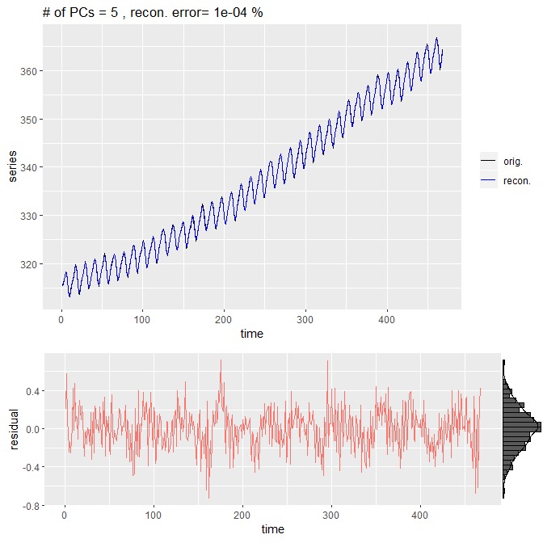
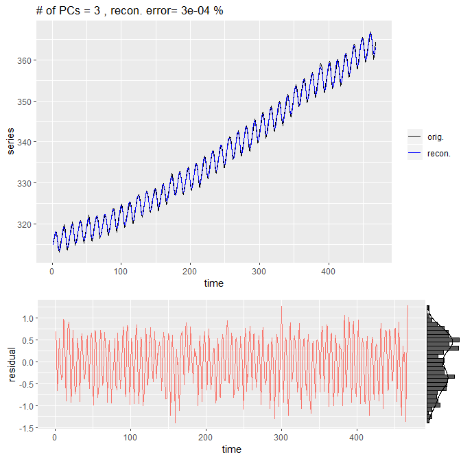
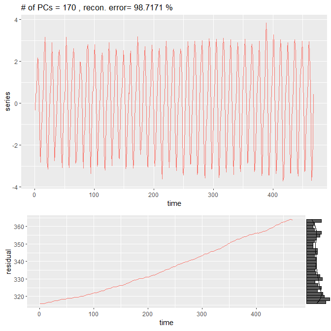
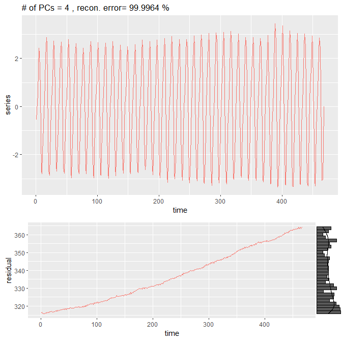

```{r setup, include = FALSE}
knitr::opts_chunk$set(
  collapse = TRUE,
  comment = "#>"
)
library(math5973NivProj2)
```


# Introduction

Spectral decomposition of a 1-d time series, a Singular Spectrum Analysis (SSA), traces back to the 1940's in the works of Karhunen (1946) and Loeve (1945). This decompositon on a 1-d time series was widely used in signal processing and known as the Karhunen-Loeve decomposition. Broomhead and King (1986) and Fraedrich (1986) came up with the idea to use multichannel SSA for multivariate time series, and used this concept to study nonlinear dynamics of strange attractors. From the late 80's to the early 2000's, Ghil applied these methods to study oceanic and atmospheric dynamics. These methods used embedding theory and exploited the eigendecomposition of the resulting covariance matrix. This brief overview was extracted from the survey paper by Ghil [1].

This package uses an equivalent method, the Singular Value Decomposition, to reconstruct the embedded trajectory matrix. In-depth explanations of these methods are found in [3].
 
# Theory

The main use of Eigen decomposition of series data is to extract the 'signal' in the data from the 'noise'. A major advantage of using a model-free method, such as Eigen decomposition, is that we can partition the signal into a major and minor component. Colloquially called the 'Caterpillar-SSA', Golyandina et. al [2] first described using the Singular Value Decomposition (SVD) of the trajectory matrix and diagonal averaging post-reconstruction. We will exhibit in subsection 2, that the Singular Value Decomposition is a generalized form of the Eigen Decomposition, and therefore, the methods using SVD and Eigen decomposition are equivalent. We chose the Caterpillar method simply because we felt that it is easier for the user to grasp the underlying mathematical concepts.

## 1. Embedding
    
Given a series, spatial or temporal, we must first determine a window length in which we will observe the series in detail. For example, when analyzing data that is obtained at a daily interval, the user may choose a window length of 7 to understand the interweekly signal of the data.

Let $N$ be the length of the series, $m$ be the window length, then if we move the window one time step until the end we will have $n=N-m+1$ window 'frames'. We concatenate these frames as columns of a matrix $X$ that we call the trajectory matrix and has dimension $m \times n$. The trajectory matrix exhibits a Hankel structure, where the skew-diagonals are constant.

### Constructor method `ssa()`
The constructor function `ssa(series, window.length)` takes in a 1-d time series and creates the trajectory matrix based on `m=window.length`.

```{r embed}
obj=ssa(co2,18) #using the Keeling CO2 curve
obj$X[,1:10] #first few columns 
```


## 2. Singular Value Decomposition
    
The singular value decomposition is a generalized form of the Eigen decomposition. For a full rank, square matrix $A$, the Spectral Decomposition Theorem says that $A$ can be written as $A=V\Lambda V'$, where $V$ is a matrix whose columns are the eigenvectors of $A$ and $\Lambda$ is a diagonal matrix with the corresponding eigenvalues as its entries.

Given a non-square population matrix $X \in \mathbb{R}^{m\times n}$ for a set of $n$ variables, $X$ is full rank if $\dim(X)=\min(m,n)$. The rank is the number of values in the spectrum, the set of eigenvalues, of a matrix. This happens when the columns of $X$ are linearly indepedent, which is typically the case for data matrices sampled from the population. In the overdetermined case, where $m > n$, the Gramian matrix of $X$ is $G=X'X \in \mathbb{R}^{n \times n}$. Since this is the population matrix the Gramian gives us the second moment matrix. If the columns of $X$ are centered before calculating the Gramian matrix, then $\tilde{G} = C_1$, which is the full rank covariance matrix of $X$. In an underdetermined case, where $ m < n$, we can simply transpose $X$ and perform the same calculations as above. We get that the Gramian is $G=XX'$ and the full rank covariance matrix is$C_2 = \tilde{G}$. As a note, we know that these covariance matrices are full rank because in the underdetermined (overdetermined) case, the row (column) vectors form a basis for the column space of $X$. This means that the number of distinct eigenvalues must be equal to the number of row (column) vectors for the underdetermined (overdetermined) case.

Since the covariance matrices $C_1,C_2$ are full rank, they can be written as Eigen decompositions $C_1 = V'\Lambda V'$ and $C_2 = U \Lambda U'$. These $\Lambda$ matrices are the same for entries up to $k=rank(X)$ entry, all eigenvalues beyond that are zero (i.e., collapsed onto the null space). Full rank matrices have positive eigenvalues. Matrices with real entries have real eigenvalues. These last two facts will be taken for granted, as the derivation of these facts are beyond the scope of this vignette. Since the entries of $\Lambda$ are real and positive, we can write $\Lambda^{1/2}\Lambda^{1/2} = \Lambda$ where the entries of $\Lambda^{1/2}$ are the square roots of the entries of $\Lambda$. We call these the **singular values**.

Suppose the columns of $X$ are centered and consider the Gramian 
$$X'X = V \Lambda V' = V \Lambda^{1/2} \Lambda^{1/2} V'$$. 

Since eigenvectors are orthogonal to each other, $U'U = UU' = I$, then we can write   
$$X'X = V \Lambda^{1/2} I \Lambda^{1/2} V' = V \Lambda^{1/2} U' U\Lambda^{1/2} V' = (U\Lambda^{1/2} V')'(U\Lambda^{1/2} V') $$.

Therefore, we can say that 

$$ X = U\Lambda^{1/2} V'$$.

We can check that 
$$XX' = U\Lambda^{1/2} V'(U\Lambda^{1/2} V')' = U\Lambda^{1/2} V' V \Lambda^{1/2} U' = U\Lambda^{1/2} I \Lambda^{1/2} U' = U\Lambda^{1/2}\Lambda^{1/2} U'= U\Lambda U'$$.

We call $U$ the left eigenvectors and $V$ the right eigenvectors. In a principal component analysis, we would look at $Y=XV$ where the columns of $Y$ are called principal components. Using the SVD form, we can write $Y=XV = U\Lambda^{1/2} V' V = U\Lambda^{1/2}$. Hence the principal components are the left eigenvectors scaled by their singular values, and the principal components analysis techniques apply. For SSA, we look at this decomposition. 

### Constructor method `ssa()`

When creating an "ssa" class object, the constructor function also calculates the singular value decomposition of the trajectory matrix and stores it as a variable `X.svd`.

```{r svd,  R.options=list(max.print=30)}
print(obj$X.svd)
```

## 3. Grouping

Notice that

$$X = U\Lambda^{1/2} V' = \sum^m_{i=1} \sqrt{\lambda_i} u_i v_i'$$.

This partitions $X$ into $m$ matrices in $\mathbb{R}^{m \times n}$, similar to a principal component. The $i^{th}$ partition is the original data projected onto the $i^{th}$ 1-D eigenspace with the $i^{th}$ eigenvector as its basis. Moreover, this is a Rank 1 projection.

Suppose $X$ is a covariance matrix, then the total variance is $tr(X) = tr(V \Lambda V') = tr(V'V \Lambda) = tr(I \Lambda) = tr(\Lambda) = \sum_{i=1}^m \lambda_i$. Therefore, the proportion of variance accounted for by the $j^{th}$ eigenspace is 
$$\frac{\lambda_j}{\sum_{i=1}^m \lambda_i}$$.

Given a time series that exhibits oscillatory behavior, such as the Keeling Curve from Mauna Loa Observatory, one can generally look at the Fourier series $\sum_{i=1}^n A_i \cos(2\pi \omega i)$ and expect to find a trend, major signal, minor signal, and noise components. Although the SVD is a linear combination, the eigenspaces are not linear in the sense that the values within a vector can be expressed as $x_i = ci$ for some constant $c$. Therefore, the principal components exhibit behavior similar to Fourier terms. We can group these partitions similarly by looking at the singular values, also known as a scree plot, which is readily available by calling the S3 method `plot` for the `ssa` class object.

### `plot(ssa,pcs=1:4)`


Since the magnitudes of the major and minor signal eigenvalues will be very different, viewing them in the log scale can make it easier to pick the eigenvalues similar in magnitudes.

### `print(ssa)`

```{r print, echo=FALSE}
print(obj)
```

Another way to look at the groupings is by calling the S3 method `print` for the `ssa` class object that prints the standard deviations (singular values) in descending order.

### `summary(ssa)`

```{r summary, echo=FALSE}
summary(obj)
```

The S3 method `summary` gives the proportion of total and cumulative variance for each of the principal components.

### `combinepatterns(ssa,pcs)`

These groupings indicate components related to a signal and can be analyzed by using the summation defintion $\sum_{i=r}^t \sqrt{\lambda_i} u_i v_i'$ where $r$ is the first eigenvalue in the group and $t$ is the last. If we wanted to inspect closely a grouping, we can call the `combinepatterns` function and specify which eigenvectors to be grouped and plotted.


## 4. Reconstruction
    
The main reason we chose to use SVD for SSA is the ease of interpretation in reconstructing the data. In the Eigen decomposition paradigm, the $k$-rank projection of $X$ onto the first $k$ eigenvectors $Y_k=XV_k$ where $V_k$'s columns are the $k$ eigenvectors. In this projection, we lose some information about $X$ and projecting $Y_k$ back into the original column space of $X$ is done by $Y_kV_k' = \tilde{X}$ where $\tilde{X}$ denotes the $k$-rank approximation of $X$. The author believes that this is not so straightforward of an interpretation of $\tilde{X}$. 

Using SVD, we can get the $k$-rank approximation of $X$ by using the summation definition $\sum^k_{i=1} \sqrt{\lambda_i} u_i v_i'$. Hence, the $k$-rank approximation is interpreted as the sum of $k$ orthonal projections of $X$.

### `reconstruct(ssa,pcs=1:5)`




### `reconstruct(ssa,pct.var=0.99999)`




# Basic uses of SSA

## Trend extraction

When doing a time series analysis, one must extract the trend in order to say something about the deviation from the mean signal. Using Caterpillar-SSA, we can extract the trend by looking at the largest singular value. This is done easily using the `reconstruct` function.

```{r detrend,eval=FALSE}
reconstruct(obj,pcs=2:obj$window.length,plot=T)
```


## Denoising

Separating the noise from the signal is a topic of active research. A heuristic way to separate noise from the signal using SSA is to find the grouping with the smallest singular values and omit those in the reconstruction of the data. `plot` and `reconstruct` give us the information required to do this task.


## Extraction of periodic components

Oscillatory data is found everywhere in the natural world, we can extract the oscillating components by looking at the the scree plot and extracting the grouped components using the `reconstruct` function. Furthermore, it is useful to look at the summed groupings to understand the interframe signal. Using the `combinepatterns` function, we saw that for the Mauna Loa CO2 data, components 2 through 5 summed pattern was consistent with CO2 flux associated with the vegetative respiration cycle. We can extract that component using the `reconstruct` function below.

```{r period, eval=FALSE}
reconstruct(obj, pcs=2:5)
```



# References

[1] Ghil, M., Allen, M. R., Dettinger, M. D., Ide, K., Kondrashov, D., Mann, M. E., Robertson, A. W., Saunders, A., Tian, Y., Varadi, F., and Yiou, P., Advanced spectral methods for climatic time series, Rev. Geophys., 40( 1), 1003, doi:doi:10.1029/2000RG000092, 2002. 

[2] Golyandina, N., V. Nekrutkin and A. Zhigljavsky. Analysis of Time Series Structure: SSA and related techniques. ISBN 1-58488-194-v1. Chapman and Hall/CRC, 2001.

[3] Golyandina, Nina, and Anatoly Zhigljavsky. Singular Spectrum Analysis for Time Series by Nina Golyandina, Anatoly Zhigljavsky. Berlin, Heidelberg : Springer Berlin Heidelberg : Imprint: Springer, 2013.
